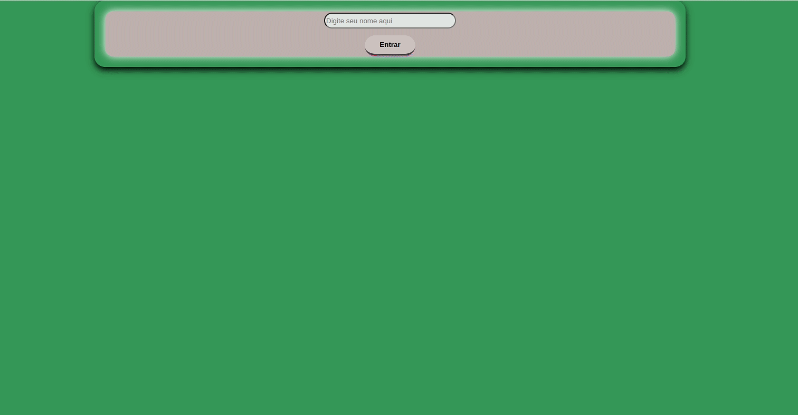

# Trybetunes

Essa aplicação foi feita usando React e a API pública do Itunes que apresenta recortes de 30 seg de cada canção.

Aplicação que consiste em um player musical que faz requisições de dados vindos de uma API, utilização dos ciclos de vida de um componente e criação de rotas na aplicação.

## 🚀 Tecnologia

- ⚡ React é uma biblioteca JavaScript de código aberto focada na criação de interfaces de usuário em páginas da web.

- ⚡ JavaScript é uma linguagem de programação interpretada estruturada, de script em alto nível com tipagem dinâmica fraca e multiparadigma.

- ⚡ HTML é a linguagem base para se desenvolver qualquer site. 

- ⚡ CSS é uma linguagem de folha de estilo composta por “camadas”, criado com o propósito de estilizar as páginas HTML.

## ✋🏻 Pré-requisitos

- [git](https://git-scm.com/downloads): Ferramenta para gerenciar o código-fonte

- [Visual Studio Code](https://code.visualstudio.com/): Editor de Código Fonte

- [React](https://reactjs.org/): Biblioteca JavaScript para criar interfaces de usuário

## :hammer_and_wrench: Antes de iniciar o projeto.

No diretório do projeto, instale as dependências e inicialize o projeto:

### `npm install`

Instala as dependências.

### `npm start`

Executa o aplicativo no modo de desenvolvimento.

Abra [http://localhost:3000](http://localhost:3000) para visualizá-lo em seu navegador.
